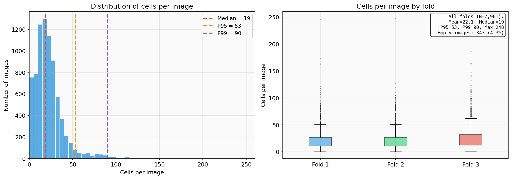
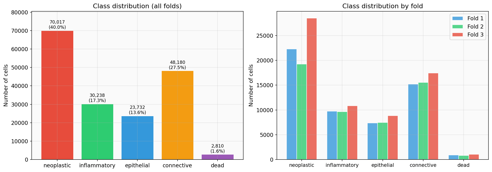
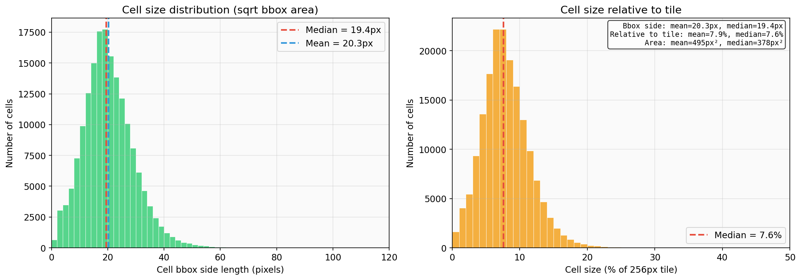
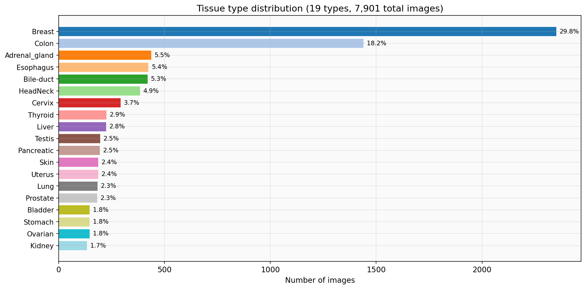

# PanNuke Dataset Statistics

PanNuke is a semi-automatically generated dataset for nuclei instance segmentation and classification in H&E stained histopathology images. It contains **7,901 images** (256x256 tiles) with **174,977 cell annotations** across **19 tissue types**, split into 3 cross-validation folds.

Source: Gamper et al., "PanNuke: An Open Pan-Cancer Histology Dataset for Nuclei Instance Segmentation and Classification" (2019, 2020).

## Overview

| Metric | Value |
|--------|-------|
| Total images | 7,901 |
| Total annotations | 174,977 |
| Tile size | 256 x 256 pixels |
| Stain | H&E |
| Tissue types | 19 |
| Cell classes | 5 |
| Folds | 3 (official CV protocol) |

## Cells Per Image

| Statistic | Value |
|-----------|-------|
| Mean | 22.1 |
| Median | 19 |
| Std | 18.0 |
| Min / Max | 0 / 248 |
| P5 / P95 | ~1 / 53 |
| P99 | 90 |
| P99.5 | 106 |
| Empty images | 343 (4.3%) |

**Implication for num_queries:** 100 queries covers P99 (90 cells). The default of 300 from RF-DETR (designed for COCO) wastes compute on ~200+ unmatched background queries per image.

## Cell Class Distribution

| Class | Count | % |
|-------|------:|--:|
| Neoplastic | 70,017 | 40.0% |
| Connective | 48,180 | 27.5% |
| Inflammatory | 30,238 | 17.3% |
| Epithelial | 23,732 | 13.6% |
| Dead | 2,810 | 1.6% |

**Heavily imbalanced.** Neoplastic cells dominate at 40%, dead cells are extremely rare at 1.6%. This imbalance means:
- A uniform score threshold (e.g. 0.3) hurts rare class recall
- Per-class threshold calibration is critical for mPQ (see `experiments/calibrate_thresholds.py`)
- The focal loss alpha should help, but dead cells remain challenging

## Cell Size

| Metric | Value |
|--------|-------|
| Bbox side (mean) | 20.3 px |
| Bbox side (median) | 19.4 px |
| Bbox area (mean) | 495 px^2 |
| Bbox area (median) | 378 px^2 |
| % of tile (mean) | 7.9% |
| % of tile (median) | 7.6% |

Cells are **small objects** -- each occupies roughly 8% of the tile width. This is characteristic of histopathology and explains why:
- High-resolution mask supervision matters (mask_loss_resolution=128, upsample_factor=4)
- SAHI (sliced inference) may help detect boundary cells
- Feature pyramid (FPN) with fine-grained levels is important

## Tissue Type Distribution

| Tissue | Images | % |
|--------|-------:|--:|
| Breast | 2,351 | 29.8% |
| Colon | 1,440 | 18.2% |
| Adrenal gland | 437 | 5.5% |
| Esophagus | 424 | 5.4% |
| Bile-duct | 420 | 5.3% |
| Head & Neck | 384 | 4.9% |
| Cervix | 293 | 3.7% |
| Thyroid | 226 | 2.9% |
| Liver | 224 | 2.8% |
| Testis | 196 | 2.5% |
| Pancreatic | 195 | 2.5% |
| Skin | 187 | 2.4% |
| Uterus | 186 | 2.4% |
| Lung | 184 | 2.3% |
| Prostate | 182 | 2.3% |
| Bladder | 146 | 1.8% |
| Ovarian | 146 | 1.8% |
| Stomach | 146 | 1.8% |
| Kidney | 134 | 1.7% |

Breast and Colon together account for **48%** of the dataset. The official mPQ metric averages PQ per-class *within* each tissue type, then across tissue types -- so rare tissues (Kidney, Stomach, Bladder) have equal weight to Breast despite having 17x fewer images.

## Per-Fold Statistics

| Fold | Images | Annotations | Mean cells/img | Median cells/img |
|------|-------:|------------:|:--------------:|:----------------:|
| 1 | 2,656 | 55,569 | 20.9 | 18 |
| 2 | 2,523 | 52,754 | 20.9 | 18 |
| 3 | 2,722 | 66,654 | 24.5 | 20 |

Fold 3 is slightly denser (24.5 vs 20.9 mean cells/image). All folds have similar class proportions.

## Raw Data Format

PanNuke raw data consists of three `.npy` files per fold:
- `images.npy` -- (N, 256, 256, 3) uint8 RGB tiles
- `masks.npy` -- (N, 256, 256, 6) instance mask channels (0-4: cell classes, 5: background)
- `types.npy` -- (N,) tissue type indices

**Channel order (critical):** Raw mask channels 2-4 are connective/dead/epithelial, NOT epithelial/connective/dead as some papers assume. The converter (`mhc_path/data/converters.py`) handles this mapping correctly.
